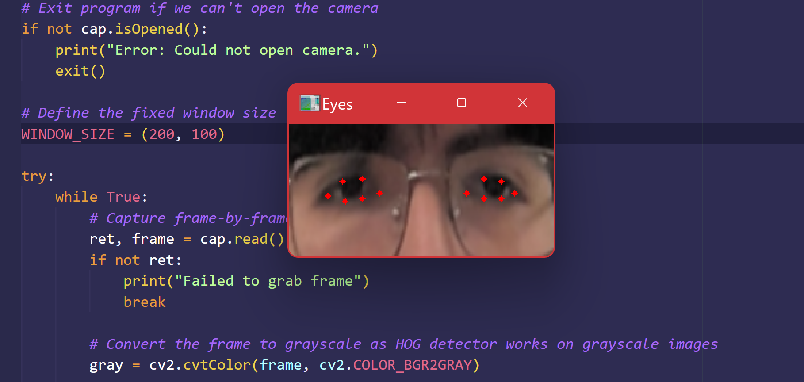
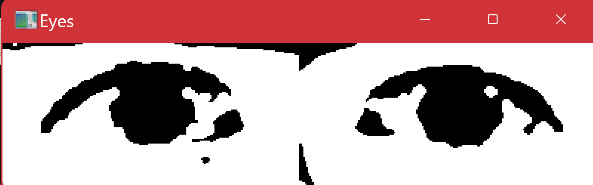

# Title: A Neural Network Gaze Estimator

## Project Description 

    
    

This project focuses on training a neural network (NN) to track a user's eye movement and classify their gaze direction and eye status. The model will take input from a camera and determine whether a user is blinking, looking forward, left, right, down, or up.  

To achieve this, a dataset of eye images will be collected and labeled, ensuring diversity across individuals, lighting conditions, and head positions. The trained NN will then be tested in real-time on different cameras to evaluate its accuracy across various users and conditions.  

This research builds on my previous work in assistive robotics, where I explored gaze-based control for navigation however without using any ML. The ability to accurately estimate gaze direction could further enable hands-free control in assistive technologies and human-computer interaction applications.  

## Project Goals

1. **Create a dataset** containing images from multiple individuals, capturing different gaze directions and eye statuses under varied conditions.  
2. **Train a neural network** to accurately classify eye movement directions and blinking states.  
3. **Test the model** across different cameras and user environments to verify general condition.  
4. **Optimize performance** to ensure real-time responsiveness.  
